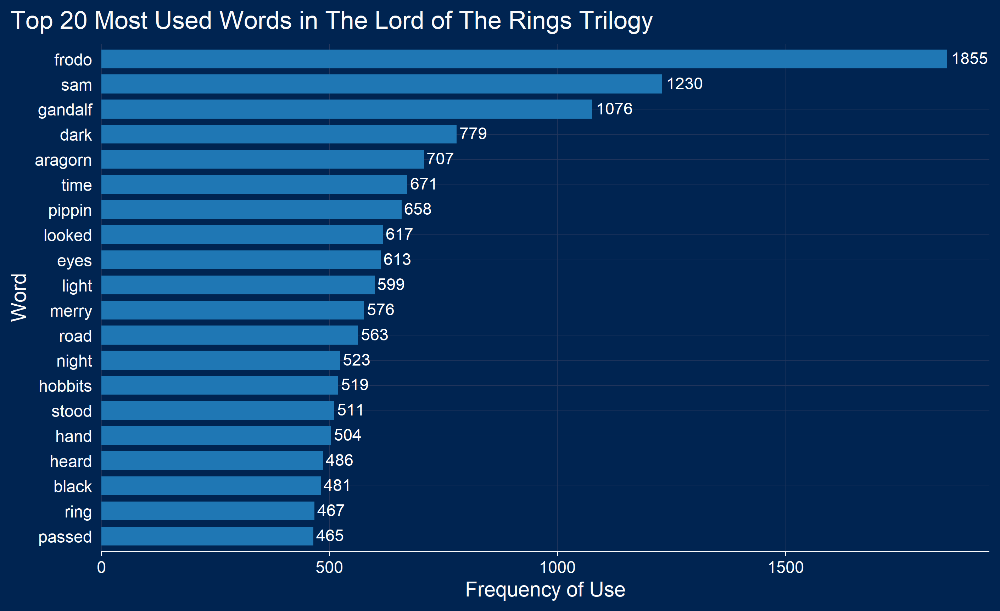
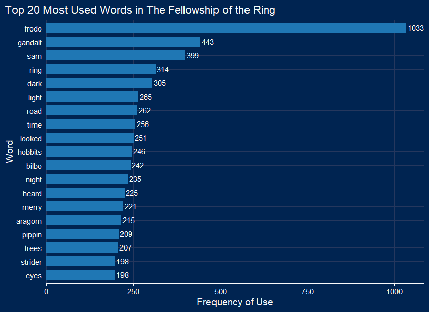
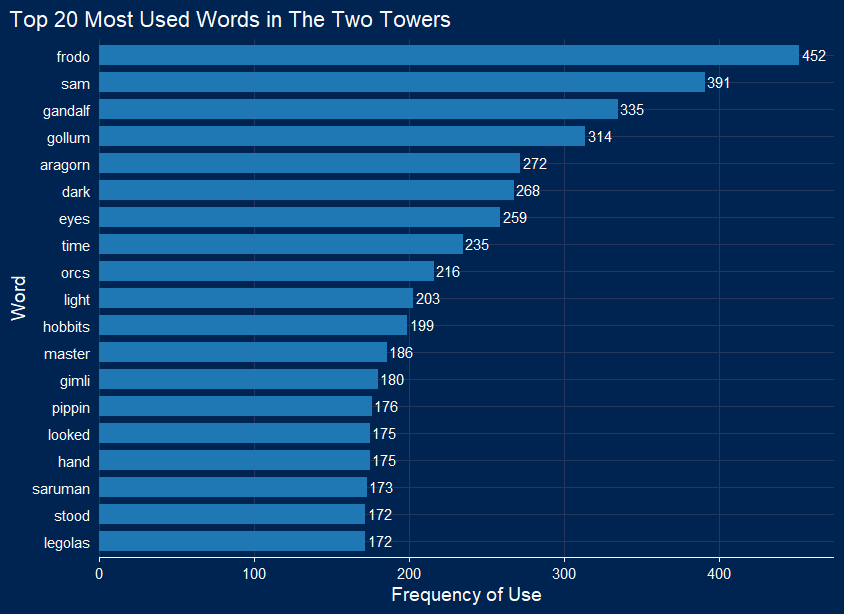
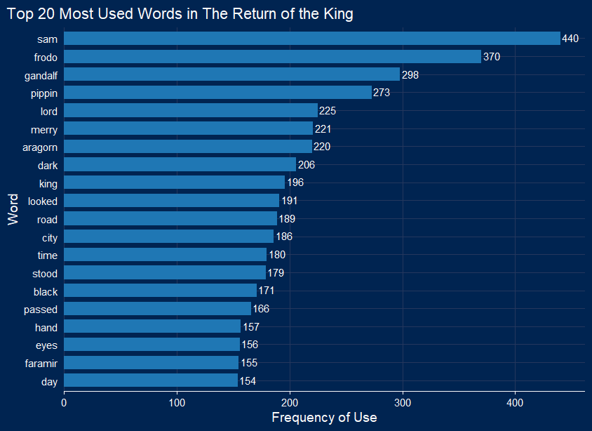

# Exploring NLP Methods with The Lord of The Rings
*this project is ongoing*
## Inspiration
I have been a huge fan of Tolkien's works since I first read the Lord of the Rings trilogy at 10 years old. However, reading the books is far different than listening to them. With the audiobooks, I am more attentive to Tolkien's writing patterns and vocabulary, and how much of a different voice is present across his extended works as compared to the original trilogy. Additionally, I noticed that there appears to be a shift in emotional affect throughout the course of The Lord of the Rings Trilogy. Shortly after I was noticing these patterns, I heard a [Data Skeptic podcast](https://dataskeptic.com/blog/episodes/2019/text-mining-in-r) that inspired me to explore these patterns changes: an NLP project analyzing The Lord of The Rings, and, if I can find the data, expand to Tolkien's full works. 
### Part 1:  Trilogy Word Frequency

<!--  -->

### Part 2:  Word Frequency by Book

<!-- 

 -->

 
 
